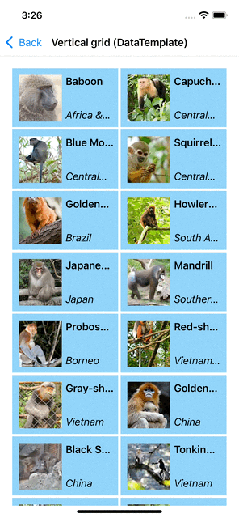
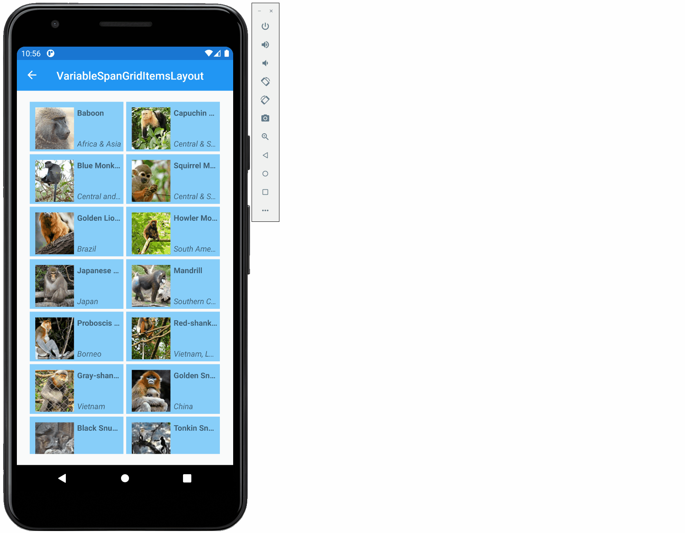

# ReorderableCollectionView for .NET MAUI

[](https://www.nuget.org/packages/ReorderableCollectionView.Maui/)

The ReorderableCollectionView extends the standard [CollectionView](https://docs.microsoft.com/en-us/dotnet/api/xamarin.forms.collectionview) to include 2 new features:
1. Item reordering
2. Support for a new [ItemsLayout](https://docs.microsoft.com/en-us/dotnet/api/xamarin.forms.structureditemsview.itemslayout) called `VariableSpanGridItemsLayout`

Aside from that, it will behave & function exactly as the standard `CollectionView`. The 2 are not dependent on one another. The existing `GridItemsLayout` & `LinearItemLayout` are also compatible with this new control's reordering feature.

<br/>



<br/>

The `VariableSpanGridItemsLayout` is much like the [GridItemsLayout](https://docs.microsoft.com/en-us/dotnet/api/xamarin.forms.griditemslayout) however it does not have a fixed span. It instead has a column span which will vary based on the size of the control. Rather than having item sizes that grow & shrink, the span will grow & shrink. If desired, items can span multiple columns by supplying a custom lookup.


<!--  -->

# Getting started

The project is up on NuGet at the following URL:

https://www.nuget.org/packages/ReorderableCollectionView.Maui

Install this package into your shared project and your platform specific projects (Android, iOS, and UWP).

Register the view handlers in `MauiProgram.cs`. To do this, have the builder call `RegisterReorderableCollectionView()`.

```c#
public static MauiApp CreateMauiApp()
{
	var builder = MauiApp.CreateBuilder();
	builder
		.UseMauiApp<App>()
		.RegisterReorderableCollectionView();
	return builder.Build();
}
```

Then simply add the namespace declaration to your files:

In your C# pages, add:

```c#
using ReorderableCollectionView.Maui;
```

In your XAML page, add the namespace attribute:

```xml
xmlns:rcv="clr-namespace:ReorderableCollectionView.Maui;assembly=ReorderableCollectionView.Maui"
```

# Syntax

Reordering is enabled & disabled through the `CanReorderItems` property. 

Additionally, if you'd like to mix items between different groups you'll need to enable the `CanMixGroups` property. By default, group A items can only be reordered within group A. You won't be able to drag an item from group A into group B unless you set `CanMixGroups` to `true`.

```xml
<ContentPage xmlns="http://schemas.microsoft.com/dotnet/2021/maui"
             xmlns:x="http://schemas.microsoft.com/winfx/2009/xaml"
             xmlns:rcv="clr-namespace:ReorderableCollectionView.Maui;assembly=ReorderableCollectionView.Maui"
             x:Class="MyLittleApp.MainPage">

     <Grid>

        <rcv:ReorderableCollectionView ItemsSource="{Binding Monkeys}" CanReorderItems="True" CanMixGroups="False" />

    </Grid>

</ContentPage>
```

Here's the sytax if you'd like to try the new `VariableSpanGridItemsLayout`.

```xml
<ContentPage xmlns="http://schemas.microsoft.com/dotnet/2021/maui"
             xmlns:x="http://schemas.microsoft.com/winfx/2009/xaml"
             xmlns:rcv="clr-namespace:ReorderableCollectionView.Maui;assembly=ReorderableCollectionView.Maui"
             x:Class="MyLittleApp.MainPage">

     <Grid>

        <rcv:ReorderableCollectionView ItemsSource="{Binding Monkeys}">
           <rcv:ReorderableCollectionView.ItemsLayout>
              <rcv:VariableSpanGridItemsLayout ItemWidth="150" ItemHeight="80"
                                                VerticalItemSpacing="5"
                                                HorizontalItemSpacing="5" />
           </rcv:ReorderableCollectionView.ItemsLayout>
        </rcv:ReorderableCollectionView>

    </Grid>

</ContentPage>
```

The default column span for each item within a `VariableSpanGridItemsLayout` is 1. This can be overridden by supplying an optional custom `ItemSpanLookup`. (Optional)

```C#
public class SpanLookup : ISpanLookup
{
    public int GetColumnSpan(object item)
    {
        if (item is Monkey monkey && monkey.Name == "Blue Monkey")
        {
            return 2;
        }
        return 1;
    }
}

```

<br/>

# Properties

Properties for the ReorderableCollectionView 

| Property | Type | Description |
| --- | --- | --- |
| `CanReorderItems`| bool | Gets or sets a value that indicates whether items in the view can be reordered through user interaction. |
| `CanMixGroups`| bool | Gets or sets a value that indicates whether items from different groups can be mixed during reordering. |

Properties for the VariableSpanGridItemsLayout 

| Property | Type | Description |
| --- | --- | --- |
| `ItemWidth`| double | Gets or sets the width of the layout area for each item contained within the grid. |
| `ItemHeight`| double | Gets or sets the height of the layout area for each item contained within the grid. |
| `HorizontalItemSpacing`| double | Gets or sets the horizontal spacing between items. |
| `VerticalItemSpacing`| double | Gets or sets the vertical spacing between items. |
| `ItemSpanLookup`| IItemSpanLookup | Gets or sets a lookup that can assign custom column spans to each item. |  

<br/>

# Events

| Event | Type | Description |
| --- | --- | --- |
| `ReorderCompleted`| EventHandler | Event that is triggered whenever reordering completes. |

<br/>

# Limitations

The UWP platform can only reorder [ObservableCollections](https://docs.microsoft.com/en-us/dotnet/api/system.collections.objectmodel.observablecollection-1).  

The UWP platform cannot reorder grouped items. Nor can it reorder items within a `VariableSpanGridItemsLayout` that uses a custom `ItemSpanLookup`. This is due to the built-in reordering mechanisms provided by UWP's ListView, GridView, & VariableSizedWrapGrid. When a custom `ItemSpanLookup` is supplied, the UWP renderer will use a [VariableSizedWrapGrid](https://docs.microsoft.com/en-us/uwp/api/windows.ui.xaml.controls.variablesizedwrapgrid) as the ItemsPanel. According to the official docs:

*"Built in reordering is not supported when items are grouped, or when a VariableSizedWrapGrid is used as the ItemsPanel."*  
https://docs.microsoft.com/en-us/uwp/api/windows.ui.xaml.controls.listviewbase.canreorderitems

<br/>

# Donate

If you found this helpful you can buy me a coffee:)

<a href="https://www.buymeacoffee.com/billvenhaus" target="_blank"></a>

